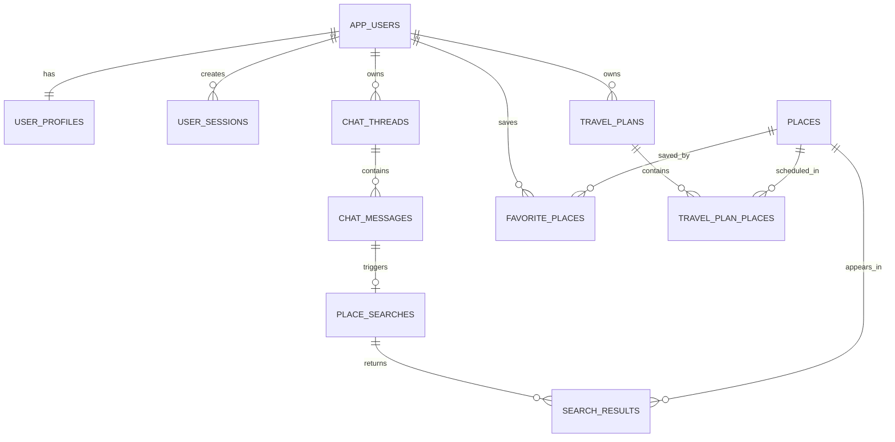
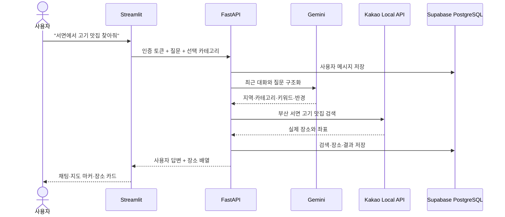

# 부산여행 가이드 2팀 설계

## 1. 목표

기존 교육용 Provider 비교 UI를 실제 이용자용 부산 여행 서비스로 교체한다. 로그인한 사용자는 자연어 AI 채팅 또는 지역·카테고리 선택으로 부산 장소를 검색하고, Kakao Local API에서 확인된 실제 장소를 카드와 Kakao 지도에서 확인하며 즐겨찾기와 여행 계획을 저장할 수 있다.

Render 배포는 이 설계의 구현 범위에 포함하지 않는다. 먼저 로컬에서 백엔드와 프론트엔드 전체 흐름을 검증한다.

## 2. 제품 원칙

- 서비스 이용에는 아이디와 비밀번호 로그인이 필요하다.
- 비밀번호 원문과 단순 SHA 해시는 저장하지 않는다. Argon2id PHC 문자열만 저장한다.
- 사용자에게 Provider, 모델 비교, 원본 JSON, Pydantic 같은 개발자 정보를 노출하지 않는다.
- LLM은 검색 의도와 추천 설명을 만들지만 장소 ID·이름·주소·좌표·전화번호·상세 URL은 Kakao 데이터만 신뢰한다.
- 기본 검색 범위는 부산이며 부산의 구·동·명소를 중심으로 결과를 제한한다.
- AI 채팅은 앞선 대화와 현재 검색 조건을 기억하는 연속 대화형이다.
- 프론트엔드는 백엔드 API만 호출한다. Supabase Service Role Key, Gemini API Key, Kakao REST Key는 백엔드에만 둔다.

## 3. 선택한 접근

### 인증

이메일 없는 자체 `username + password` 인증을 사용한다. Supabase PostgreSQL은 데이터 저장소로 사용하지만 Supabase Auth 사용자 로그인은 사용하지 않는다. 백엔드가 Service Role로 DB에 접근하고 모든 사용자 소유 쿼리를 검증된 세션의 `user_id`로 제한한다.

비밀번호는 Argon2id로 해시한다. 로그인 성공 시 충분히 긴 임의 세션 토큰을 발급하고, 프론트에는 토큰 원문을 한 번 전달하며 DB에는 SHA-256 토큰 해시만 저장한다. 로그아웃과 만료 시 세션을 폐기한다.

### 검색과 AI

Gemini는 대화 문맥과 새 질문에서 `부산 지역`, `장소 유형`, `검색 키워드`, `기준 위치`, `검색 반경`, `정렬 의도`를 구조화한다. 백엔드는 구조화 결과를 검증한 뒤 Kakao Local 키워드 검색을 수행한다. Kakao 결과가 없거나 LLM 호출이 실패하면 사용자가 선택한 카테고리와 입력 문장에서 만든 결정적 검색어로 대체 검색한다.

### 프론트엔드

Streamlit은 유지하되 개발자 교육 메뉴를 사용자용 단일 앱으로 교체한다. 좌측 사이드바는 로그인 상태, 부산 지역, 카테고리, 빠른 키워드, 즐겨찾기 메뉴를 제공한다. 메인 영역은 서비스 소개, AI 채팅, 현재 검색 조건, Kakao 지도, 장소 카드로 구성한다.

## 4. 논리 ERD와 카디널리티



카디널리티는 다음과 같다.

- `app_users : user_profiles = 1 : 1`
- `app_users : user_sessions = 1 : N`
- `app_users : chat_threads = 1 : N`
- `chat_threads : chat_messages = 1 : N`
- `chat_messages : place_searches = 1 : 0..1`
- `place_searches : places = N : M`, `search_results`로 해소
- `app_users : places = N : M`, `favorite_places`로 해소
- `travel_plans : places = N : M`, `travel_plan_places`로 해소

## 5. 물리 테이블

### `app_users`

- `id uuid primary key default gen_random_uuid()`
- `username text not null`
- `normalized_username text not null unique`
- `password_hash text not null`
- `is_active boolean not null default true`
- `created_at timestamptz not null default now()`
- `updated_at timestamptz not null default now()`

`normalized_username`은 앞뒤 공백을 제거하고 소문자로 변환한 로그인 비교값이다. 사용자 아이디는 4~30자의 영문 소문자, 숫자, 밑줄만 허용한다.

### `user_profiles`

- `user_id uuid primary key references app_users(id) on delete cascade`
- `display_name text not null`
- `created_at timestamptz not null default now()`
- `updated_at timestamptz not null default now()`

### `user_sessions`

- `id uuid primary key default gen_random_uuid()`
- `user_id uuid not null references app_users(id) on delete cascade`
- `token_hash text not null unique`
- `expires_at timestamptz not null`
- `revoked_at timestamptz null`
- `created_at timestamptz not null default now()`

활성 세션 조회를 위해 `(token_hash, expires_at)` 인덱스를 둔다.

### `chat_threads`

- `id uuid primary key default gen_random_uuid()`
- `user_id uuid not null references app_users(id) on delete cascade`
- `title text not null default '새 부산 여행 대화'`
- `created_at timestamptz not null default now()`
- `updated_at timestamptz not null default now()`

### `chat_messages`

- `id uuid primary key default gen_random_uuid()`
- `thread_id uuid not null references chat_threads(id) on delete cascade`
- `role text not null check (role in ('user', 'assistant'))`
- `content text not null check (char_length(trim(content)) between 1 and 4000)`
- `structured_intent jsonb null`
- `created_at timestamptz not null default now()`

`(thread_id, created_at, id)` 인덱스로 대화 순서를 안정화한다. `structured_intent`는 모델 출력의 감사·재처리용이며 검색의 주요 필드는 관계형 컬럼에 다시 저장한다.

### `place_searches`

- `id uuid primary key default gen_random_uuid()`
- `message_id uuid not null unique references chat_messages(id) on delete cascade`
- `region text not null default '부산'`
- `district text not null default ''`
- `category text not null check (category in ('food', 'cafe', 'attraction', 'shopping', 'all'))`
- `keyword text not null`
- `center_latitude double precision null`
- `center_longitude double precision null`
- `radius_meters integer null check (radius_meters between 100 and 20000)`
- `created_at timestamptz not null default now()`

### `places`

- `id uuid primary key default gen_random_uuid()`
- `kakao_place_id text not null unique`
- `name text not null`
- `category_name text not null default ''`
- `category_group_code text not null default ''`
- `address text not null default ''`
- `road_address text not null default ''`
- `latitude double precision not null check (latitude between -90 and 90)`
- `longitude double precision not null check (longitude between -180 and 180)`
- `phone text not null default ''`
- `kakao_place_url text not null check (kakao_place_url like 'https://place.map.kakao.com/%')`
- `raw_snapshot jsonb not null default '{}'::jsonb`
- `last_verified_at timestamptz not null default now()`

Kakao 장소 사실은 이 테이블에 한 번만 저장하고 검색·즐겨찾기·일정에서 참조한다.

### `search_results`

- `search_id uuid not null references place_searches(id) on delete cascade`
- `place_id uuid not null references places(id) on delete restrict`
- `result_rank integer not null check (result_rank >= 1)`
- `distance_meters integer null check (distance_meters >= 0)`
- `recommendation_reason text not null default ''`
- `primary key (search_id, place_id)`
- `unique (search_id, result_rank)`

### `favorite_places`

- `user_id uuid not null references app_users(id) on delete cascade`
- `place_id uuid not null references places(id) on delete restrict`
- `created_at timestamptz not null default now()`
- `primary key (user_id, place_id)`

### `travel_plans`

- `id uuid primary key default gen_random_uuid()`
- `user_id uuid not null references app_users(id) on delete cascade`
- `thread_id uuid null references chat_threads(id) on delete set null`
- `title text not null`
- `summary text not null default ''`
- `days integer not null check (days between 1 and 31)`
- `created_at timestamptz not null default now()`

### `travel_plan_places`

- `plan_id uuid not null references travel_plans(id) on delete cascade`
- `place_id uuid not null references places(id) on delete restrict`
- `day_number integer not null check (day_number between 1 and 31)`
- `display_order integer not null check (display_order >= 1)`
- `note text not null default ''`
- `primary key (plan_id, place_id)`
- `unique (plan_id, day_number, display_order)`

## 6. 정규화 검토

- 1NF: 사용자, 세션, 메시지, 장소의 핵심 속성은 원자값 컬럼으로 저장한다.
- 2NF: `search_results`, `favorite_places`, `travel_plan_places`의 관계 속성은 해당 복합 관계 전체에 종속된다.
- 3NF: 사용자 프로필은 로그인 정보와 분리하고, 장소 사실은 `places`에 한 번만 저장한다. 검색 순위·거리·추천 이유와 일정 일차·순서는 각 연결 테이블에 둔다.
- `raw_snapshot`과 `structured_intent` JSON은 외부 응답 보존용이며 관계형 조회에 필요한 주요 값을 대체하지 않는다.

## 7. 백엔드 구성

```text
backend/app/
├── auth/
│   ├── models.py
│   ├── password.py
│   ├── repository.py
│   └── service.py
├── chat/
│   ├── models.py
│   ├── intent_service.py
│   ├── repository.py
│   └── service.py
├── places/
│   ├── models.py
│   ├── repository.py
│   └── service.py
├── favorites/
│   ├── models.py
│   ├── repository.py
│   └── service.py
└── routers/
    ├── auth_router.py
    ├── chat_router.py
    ├── place_router.py
    └── favorite_router.py
```

각 모듈은 Pydantic 계약, 저장소, 비즈니스 서비스를 분리한다. 라우터는 인증과 HTTP 상태 변환만 담당한다.

## 8. API 계약

### 인증

- `POST /api/auth/signup`: 아이디, 비밀번호, 표시 이름으로 가입하고 세션 반환
- `POST /api/auth/login`: 아이디와 비밀번호로 로그인하고 세션 반환
- `POST /api/auth/logout`: 현재 세션 폐기
- `GET /api/auth/me`: 현재 사용자 프로필 반환

### AI 채팅과 검색

- `POST /api/chat/threads`: 새 대화 생성
- `GET /api/chat/threads`: 내 대화 목록
- `GET /api/chat/threads/{thread_id}/messages`: 내 대화 메시지
- `POST /api/chat/threads/{thread_id}/messages`: 사용자 질문 저장, 의도 구조화, Kakao 검색, 답변과 장소 반환

채팅 메시지 요청은 선택적 `district`, `category`, `quick_keyword`를 함께 받을 수 있다. 자연어에서 추출한 값보다 사용자가 화면에서 명시적으로 선택한 값을 우선한다.

### 장소와 즐겨찾기

- `POST /api/places/search`: 카테고리 선택 기반 직접 장소 검색
- `GET /api/favorites`: 내 즐겨찾기 목록
- `POST /api/favorites/{place_id}`: 즐겨찾기 추가
- `DELETE /api/favorites/{place_id}`: 즐겨찾기 삭제

모든 사용자 API는 Bearer 세션 토큰이 필요하다. `thread_id`, `place_id`, `plan_id` 접근 시 현재 사용자 소유권을 검증한다.

## 9. AI 검색 흐름



검색 결과는 Kakao 장소 ID로 중복 제거한다. 부산 주소가 아닌 결과는 제외한다. 위치 기준이 있으면 거리값을 사용하고, 없으면 Kakao 정확도 순서를 유지한다.

## 10. 프론트엔드 화면

### 전체 브랜드

- 페이지 제목: `부산여행 가이드 2팀`
- 톤: 바다색과 따뜻한 음식색을 조합한 밝은 여행 서비스
- 모바일에서는 지도와 카드가 세로로 쌓이고 데스크톱에서는 지도와 결과가 나란히 배치된다.

### 로그인 화면

- 서비스 소개와 부산 여행 핵심 혜택
- 아이디·비밀번호 로그인
- 회원가입 탭: 아이디, 표시 이름, 비밀번호, 비밀번호 확인
- 오류는 계정 존재 여부를 과도하게 노출하지 않는 한국어 문장으로 표시

### 로그인 후 사이드바

- 사용자 표시 이름과 로그아웃
- 부산 지역: 전체, 해운대, 광안리·수영, 서면·전포, 남포·자갈치, 영도, 기장, 동래·온천장
- 카테고리: 전체, 맛집, 카페, 관광지, 쇼핑
- 빠른 키워드: 돼지국밥, 밀면, 회·해산물, 고기, 브런치, 오션뷰 카페, 야경
- 즐겨찾기 보기
- 새 대화 시작

### 메인 화면

- 부산 바다 분위기의 히어로와 서비스 설명
- AI 채팅 메시지 목록
- 하단 고정형 질문 입력과 추천 질문 칩
- 현재 적용된 지역·카테고리·키워드 배지
- Kakao 지도와 검색 결과 카드
- 카드의 즐겨찾기 버튼, 주소, 전화, Kakao 상세 링크
- 검색 전에는 부산 인기 지역과 질문 예시를 표시

## 11. 상태 관리

Streamlit `session_state`에는 세션 토큰, 사용자 프로필, 현재 대화 ID, 메시지 목록, 검색 결과, 선택 필터, 즐겨찾기 ID 집합을 저장한다. API 키와 Service Role Key는 저장하지 않는다.

로그아웃 시 사용자 관련 상태를 모두 제거하고 백엔드 세션을 폐기한다.

## 12. 오류 처리

- 인증 실패: 일반화된 로그인 오류
- 세션 만료: 로그인 화면으로 복귀하고 재로그인 안내
- Gemini 실패: 선택 필터와 사용자 문장으로 Kakao 대체 검색 후 경고
- Kakao 설정 누락: 관리자 설정 오류 안내
- Kakao 빈 결과: 지역 또는 키워드 변경 제안
- 지도 JavaScript Key 오류: 카드와 Kakao 상세 링크 유지
- DB 저장 실패: 검색 결과를 표시할 수 있으면 표시하고 저장 실패를 별도 안내
- 외부 서비스 timeout: 재시도 버튼 제공

원본 예외, SQL, API 키, 인증 토큰은 사용자 응답과 화면에 노출하지 않는다.

## 13. 테스트

### SQL 계약

- 모든 PK·FK·UNIQUE·CHECK·인덱스 존재
- 카디널리티를 구현하는 FK와 연결 테이블 검증
- 비밀번호 원문 컬럼 부재
- 사용자 삭제 cascade와 장소 restrict 정책 검증

### 백엔드

- 아이디 정규화와 중복 가입
- Argon2id 해시와 잘못된 비밀번호
- 세션 발급·만료·로그아웃
- 다른 사용자의 대화·즐겨찾기 접근 거부
- Gemini 구조화 성공·실패 대체 검색
- 부산 주소 필터, Kakao 중복 제거, 좌표 매핑
- 채팅 메시지와 검색 결과 트랜잭션
- 즐겨찾기 중복 방지

### 프론트엔드

- 로그인·회원가입 payload와 세션 상태
- 지역·카테고리 선택값 우선순위
- 채팅 응답과 장소 모델 검증
- 즐겨찾기 추가·삭제 상태
- 지도 JSON 안전 직렬화
- 개발자용 Provider·원본 JSON 메뉴가 사용자 화면에 없는지 검증

### 로컬 통합 검증

- FastAPI `/health`와 인증 API
- Streamlit 로그인부터 검색까지
- 실제 Gemini와 Kakao 키를 사용한 부산 맛집 smoke test
- Kakao JavaScript Key를 사용한 지도 마커 확인

## 14. 완료 조건

- 신규 사용자가 아이디와 비밀번호로 가입·로그인할 수 있다.
- 로그인하지 않은 사용자는 여행 기능에 접근할 수 없다.
- 사용자가 부산 지역과 카테고리를 선택하거나 자연어로 질문할 수 있다.
- 연속 질문이 직전 대화 문맥과 화면 필터를 반영한다.
- 반환되는 모든 장소는 Kakao Local API에서 확인된 장소다.
- 장소가 카드와 Kakao 지도에 동시에 표시된다.
- 즐겨찾기가 사용자별로 저장되고 다시 로그인해도 유지된다.
- 개발자용 교육 메뉴와 Provider 비교 정보가 프론트엔드에 나타나지 않는다.
- SQL이 3NF 관계와 정의된 카디널리티를 만족한다.
- 기본 자동 테스트가 외부 API 없이 통과한다.
- 실제 키 smoke test에서 부산 지역 검색과 지도가 동작한다.
