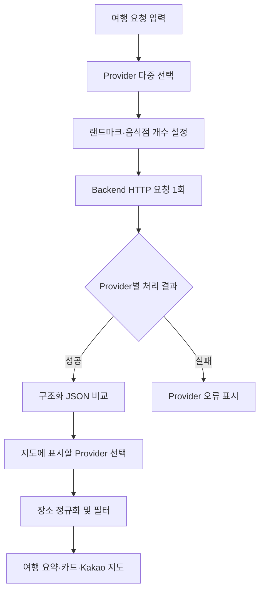

# 여행 지도 Agent 프런트엔드 계획

> 기준 프로젝트: `mini_agent_02_structured_output`
> 프런트엔드: Streamlit
> 백엔드: FastAPI
> 지도: Kakao Maps JavaScript SDK
> 문서 상태: 구현 전 계획

## 1. 문서 목적

이 문서는 사용자가 여행 요청, 비교할 LLM Provider, 랜드마크 및 음식점 추천 개수를 입력하면 FastAPI Backend가 반환한 Provider별 구조화 JSON을 비교하고, 선택한 결과의 장소를 카드와 Kakao 지도에 표시하는 Streamlit 프런트엔드의 구현 계획이다.

이 문서는 프런트엔드 구현 범위와 Backend API 의존성을 정의한다. 실제 Python 코드와 Backend 구현은 포함하지 않는다.

## 2. 현재 프로젝트 분석

기준 프로젝트에는 다음과 같은 재사용 기반이 있다.

- `frontend/app.py`: `st.Page`, `st.navigation` 기반 페이지 구성
- `frontend/app_pages/06_provider_compare.py`: `st.multiselect` 기반 Provider 비교 UI
- `frontend/app_pages/09_structured_output.py`: 입력 → Backend 호출 → Provider별 구조화 결과 출력
- `frontend/clients/agent_client.py`: 기능별 얇은 API client
- `frontend/core/api_client.py`: `httpx` 기반 공통 요청, timeout 및 오류 변환
- `backend/app/schemas.py`: Provider와 구조화 출력 Pydantic 계약
- `backend/app/routers/agent_router.py`: 여러 Provider의 성공과 실패를 하나의 결과로 반환하는 비교 패턴

현재 `/api/structured/compare`는 고정된 `travel_plan` 또는 `support_ticket` Schema를 비교하지만, 목표 기능에 필요한 `landmark_count`, `food_count`, Kakao 장소 정보, 지도용 좌표 계약은 아직 별도 확장이 필요하다.

- 새 파일은 Streamlit 페이지 `frontend/app_pages/12_travel_kakaomap.py` 하나만 추가하는 것을 기본안으로 한다.

## 3. 확정된 설계 결정

| 영역          | 결정                                                             |
| ------------- | ---------------------------------------------------------------- |
| UI            | Streamlit 유지                                                   |
| Backend 호출  | 선택한 모든 Provider를 한 번의 HTTP 요청으로 전송                |
| Provider 입력 | `mock`, `gemini`, `openai`, `ollama` 다중 선택                   |
| Output Schema | 사용자가 직접 입력하지 않고 여행 계획 Schema로 고정              |
| 랜드마크 개수 | `st.number_input`, 기본 6, 최소 1, 최대 10                       |
| 음식점 개수   | `st.number_input`, 기본 4, 최소 1, 최대 10                       |
| 결과 비교     | Provider별 상태, 모델, 지연 시간, 경고, JSON 표시                |
| 지도 결과     | 성공한 Provider 중 사용자가 선택한 한 결과를 표시                |
| 장소 배열     | `landmarks`, `foods`                                             |
| 지도          | Kakao Maps JavaScript SDK                                        |
| 보안          | Kakao REST Key는 Backend 전용, JavaScript Key는 등록 도메인 제한 |

## 4. MVP 범위

### 포함

- 자연어 여행 요청 입력
- Provider 한 개 이상 선택
- 랜드마크와 음식점 추천 개수 입력
- 여러 Provider를 포함한 Backend 요청 1회
- Provider별 성공·실패 및 구조화 JSON 비교
- 성공한 Provider의 여행 요약과 장소 카드
- 지도에 랜드마크와 음식점 마커 표시
- Provider, 일차, 장소 유형 필터
- 부분 성공, 좌표 오류, 지도 SDK 오류 처리
- Mock 기반 자동 테스트

### 제외

- 사용자 정의 JSON Schema 편집기
- 회원가입과 로그인
- 예약, 결제 및 가격 비교
- 실시간 영업시간 보장
- 교통 경로 최적화
- 여행 계획 영구 저장과 공유
- 프런트엔드에서 LLM 또는 Kakao Local REST API 직접 호출

## 5. 사용자 흐름



## 6. 화면 구성

화면은 다음 영역으로 구성한다.

1. 입력 영역
   - 여행 요청 `st.text_area`
   - Provider `st.multiselect`
   - 랜드마크와 음식점 추천 개수 `st.number_input`
   - 예상 Provider 처리 횟수와 Cloud 호출 안내
   - 요청 버튼
2. Provider 비교 영역
   - Provider별 탭 또는 카드
   - 성공·실패, 모델, 지연 시간, 실제 장소 개수
   - 경고, 오류, `st.json()` 원본 결과
3. 여행 결과 영역
   - 지도에 표시할 성공 Provider 선택
   - 여행 요약
   - 일차와 장소 유형 필터
   - 장소 카드
   - Kakao 지도

## 7. 입력 컴포넌트

계획하는 Streamlit 입력은 다음과 같다.

```python
message = st.text_area(
    "여행 요청",
    value="부산에 2박 3일 여행을 가고 싶어. 바다와 현지 음식을 좋아해.",
)

providers = st.multiselect(
    "비교할 Provider",
    options=["mock", "gemini", "openai", "ollama"],
    default=["mock"],
)

landmark_count = st.number_input(
    "랜드마크 추천 개수",
    min_value=1,
    max_value=10,
    value=6,
    step=1,
)

food_count = st.number_input(
    "음식점 추천 개수",
    min_value=1,
    max_value=10,
    value=4,
    step=1,
)
```

Backend 전송 전에 두 개수는 `int`로 변환한다. 여행 요청이 비어 있거나 Provider가 선택되지 않았거나 이미 요청 중이면 제출 버튼을 비활성화한다.

## 8. Backend API 요청 계약

### 추천 endpoint

```text
POST /api/travel-plans/compare
```

### 요청 예시

```json
{
  "message": "부산에 2박 3일 여행을 가고 싶어. 바다와 현지 음식을 좋아해.",
  "providers": ["mock", "gemini", "openai"],
  "landmark_count": 6,
  "food_count": 4
}
```

### 검증 조건

- `message`: 공백 제외 1자 이상
- `providers`: 1개 이상 4개 이하, 중복 없음
- Provider 허용값: `mock`, `gemini`, `openai`, `ollama`
- `landmark_count`: 1~10 정수
- `food_count`: 1~10 정수

프런트엔드 HTTP 요청은 선택한 Provider 수와 관계없이 한 번이다. Provider별 LLM 호출, 실패 격리, 응답 수집은 Backend가 담당한다.

## 9. Backend API 응답 계약

```json
{
  "request_count": 2,
  "landmark_count": 6,
  "food_count": 4,
  "results": [
    {
      "provider": "mock",
      "status": "success",
      "model": "mock-travel-model",
      "latency_ms": 15,
      "content": {
        "destination": "부산",
        "summary": "해안 명소와 부산 음식을 즐기는 2박 3일 일정입니다.",
        "nights": 2,
        "days": 3,
        "landmarks": [
          {
            "id": "kakao-place-id",
            "name": "해운대해수욕장",
            "place_type": "landmark",
            "category_name": "여행 > 관광명소 > 해수욕장",
            "description": "부산의 대표 해변입니다.",
            "address": "부산 해운대구 우동",
            "road_address": "부산 해운대구 해운대해변로 264",
            "latitude": 35.1587,
            "longitude": 129.1604,
            "phone": "",
            "kakao_place_url": "https://place.map.kakao.com/...",
            "day": 1,
            "order": 1
          }
        ],
        "foods": []
      },
      "warnings": [],
      "error": null
    },
    {
      "provider": "openai",
      "status": "error",
      "model": "",
      "latency_ms": 0,
      "content": null,
      "warnings": [],
      "error": "Provider 요청 처리에 실패했습니다."
    }
  ]
}
```

Provider 하나가 실패해도 성공한 결과는 유지한다. 요청 형식 오류는 HTTP 422로 처리하고, Provider별 실행 오류는 가능한 한 `results` 내부의 `status="error"`로 반환한다.

## 10. Provider 비교 결과

각 Provider 결과에 다음 정보를 표시한다.

- Provider 및 모델 이름
- 성공 또는 실패 배지
- 지연 시간
- `랜드마크 n개 / 요청 m개`
- `음식점 n개 / 요청 m개`
- 경고 목록
- 오류 메시지
- `st.json()` 구조화 결과

성공한 Provider만 지도 선택 목록에 포함한다. 성공 결과가 하나면 자동 선택하고, 둘 이상이면 `st.selectbox`로 선택한다. 선택 변경은 Backend 재호출 없이 요약, 카드, JSON, 필터, 지도를 함께 갱신한다.

## 11. 프런트엔드 모델

Backend Pydantic 모델을 직접 import하지 않는다. 프런트엔드는 JSON 계약을 기준으로 자체 Pydantic 모델을 둔다.

주요 모델 후보:

- `TravelCompareResponse`
- `ProviderTravelResult`
- `TravelPlanContent`
- `TravelPlace`

모든 모델은 예상하지 못한 필드의 처리 정책을 명확히 하고, 성공 결과에는 `content`, 실패 결과에는 `error`가 필요하도록 상태별 검증을 고려한다.

## 12. 장소 데이터 정규화

`landmarks`와 `foods`를 지도 및 카드용 단일 목록으로 합친다.

- `landmarks` 항목의 최종 유형은 `landmark`
- `foods` 항목의 최종 유형은 `food`
- `latitude`, `longitude`를 숫자로 변환
- 위도 범위: -90~90
- 경도 범위: -180~180
- Kakao의 `x`는 longitude, `y`는 latitude
- 장소 ID를 우선 사용해 중복 제거
- ID가 없으면 정규화된 이름과 좌표를 보조 기준으로 사용
- `day`, `order` 순으로 정렬
- 잘못된 좌표는 지도에서만 제외하고 카드와 JSON은 유지
- `kakao_place_url`은 `http`와 `https`만 허용

## 13. 여행 요약과 장소 카드

여행 요약에는 목적지, 박·일 수, 요약, 실제 장소 수를 표시한다.

장소 카드에는 다음 정보를 표시한다.

- 장소 유형 아이콘 또는 배지
- 장소명과 카테고리
- 설명
- 주소 또는 도로명 주소
- 전화번호
- 방문 일차와 순서
- Kakao 장소 상세 링크
- 지도 표시 가능 여부

랜드마크와 음식점은 색상과 아이콘을 함께 사용하여 구분한다. 색상만으로 의미를 전달하지 않는다.

## 14. 필터

필터는 성공한 Provider 결과에만 적용한다.

- Provider 선택
- 전체 일차 또는 특정 일차
- 전체 장소, 랜드마크, 음식점

필터 변경 시 Backend를 다시 호출하지 않고 `st.session_state`에 저장된 응답을 사용한다. 카드와 지도는 동일한 필터 결과를 사용해야 한다.

## 15. Kakao 지도 연동

MVP는 추가 패키지가 적은 `streamlit.components.v1.html` 방식을 우선 검토한다. 지도 데이터를 JSON으로 직렬화해 HTML 컴포넌트에 전달하고 Kakao Maps JavaScript SDK로 마커를 생성한다.

필수 동작:

- landmark와 food에 서로 다른 마커 아이콘
- 마커 클릭 시 장소명, 유형, 설명, 주소, 일차, 순서 정보창
- Kakao 상세 페이지 링크
- 여러 마커가 모두 보이도록 bounds 자동 조정
- 마커가 하나면 적절한 중심과 확대 수준 적용
- 유효 좌표가 없으면 지도 대신 안내 메시지
- SDK 로딩 실패 시 카드와 상세 링크 유지
- JavaScript Key가 없으면 설정 안내 표시

Streamlit iframe에서 카드와 마커의 완전한 양방향 선택 연동은 제약이 있을 수 있다. MVP에서는 필터 결과를 카드와 지도에 동시에 적용하는 단방향 연동을 우선하고, custom component 기반 양방향 이벤트는 확장 단계로 둔다.

## 16. 상태 관리

`st.session_state`에 다음 상태를 보관한다.

- 요청 처리 중 여부
- 마지막 요청 payload
- 마지막 정상 Backend 응답
- 성공한 Provider 목록
- 선택된 지도 Provider
- 선택된 일차
- 선택된 장소 유형
- 정규화된 장소 목록
- 마지막 오류

필터와 Provider 선택 변경은 Backend 재호출을 발생시키지 않는다. 새 요청 성공 시 이전 결과를 교체한다. 새 요청 전체가 실패한 경우 이전 결과를 유지하되, 화면에 현재 요청 실패임을 분명히 표시하는 방식을 권장한다.

## 17. 오류 및 부분 성공 처리

| 상태               | 프런트엔드 동작                    |
| ------------------ | ---------------------------------- |
| 422                | 입력 또는 계약 오류 안내           |
| 502·503            | Backend 또는 외부 서비스 오류 안내 |
| 504·client timeout | 응답 시간 초과 안내                |
| Backend 연결 실패  | 서버 실행 상태 확인 안내           |
| JSON 파싱 실패     | 올바른 JSON 응답이 아니라는 안내   |
| 일부 Provider 실패 | 실패 카드와 성공 결과를 함께 표시  |
| 전체 Provider 실패 | 오류 요약, 지도 비활성화           |
| 장소 부족          | 실제 개수와 경고 표시              |
| 일부 좌표 오류     | 해당 장소를 지도에서 제외하고 경고 |
| 지도 SDK 실패      | 카드, JSON, Kakao 링크 유지        |

원본 SDK 예외, API Key, stack trace는 사용자에게 노출하지 않는다.

## 18. 환경 변수와 보안

```dotenv
BACKEND_API_URL=http://127.0.0.1:8000
REQUEST_TIMEOUT_SECONDS=60
KAKAO_JAVASCRIPT_KEY=
```

- `KAKAO_REST_API_KEY`는 Backend 전용이다.
- `KAKAO_JAVASCRIPT_KEY`는 브라우저 지도 SDK용이며 등록 도메인을 제한한다.
- 실제 `.env`를 커밋하지 않는다.
- `.env.example`에는 빈 값만 둔다.
- 장소명, 설명, 주소 등은 정보창 HTML에 삽입하기 전에 escape한다.
- JavaScript 문자열 연결 대신 JSON 직렬화를 사용한다.
- 외부 URL은 scheme을 검증한다.

## 19. 접근성과 반응형 UI

- 넓은 화면에서는 입력과 결과 또는 카드와 지도를 열로 배치한다.
- 좁은 화면에서는 세로 흐름을 우선한다.
- landmark와 food는 색상뿐 아니라 아이콘과 텍스트로 구분한다.
- 오류와 경고는 의미가 명확한 문장으로 제공한다.
- 모든 외부 링크는 목적지를 알 수 있는 레이블을 사용한다.
- 지도 없이도 장소 정보와 링크를 사용할 수 있어야 한다.

## 20. 목표 폴더 구조

### MVP

```text
frontend/
├── app.py
├── app_pages/
│   └── 01_travel_map_compare.py
├── clients/
│   └── travel_client.py
├── core/
│   └── api_client.py
├── models/
│   └── travel.py
└── components/
    ├── place_cards.py
    └── kakao_map.py
```

### 계약 안정화 이후

```text
frontend/
├── components/
│   ├── provider_results.py
│   ├── trip_summary.py
│   ├── place_cards.py
│   ├── result_filters.py
│   └── kakao_map.py
└── tests/
```

## 21. 파일별 변경 계획

| 파일                                          | 구분        | 책임                                            |
| --------------------------------------------- | ----------- | ----------------------------------------------- |
| `frontend/app.py`                             | 수정        | 여행 지도 비교 페이지 등록 및 navigation 연결   |
| `frontend/app_pages/01_travel_map_compare.py` | 신규        | 입력, 요청, 결과 비교, 필터, 카드와 지도 조합   |
| `frontend/clients/travel_client.py`           | 신규        | `/api/travel-plans/compare` 단일 요청           |
| `frontend/core/api_client.py`                 | 수정 검토   | 환경 기반 timeout과 기존 오류 처리 재사용       |
| `frontend/core/config.py`                     | 선택적 신규 | Backend URL, timeout, Kakao JavaScript Key 설정 |
| `frontend/models/travel.py`                   | 신규        | Backend 응답과 장소 데이터 검증                 |
| `frontend/components/place_cards.py`          | 신규        | 장소 카드 렌더링                                |
| `frontend/components/kakao_map.py`            | 신규        | 안전한 지도 HTML 및 JavaScript 생성             |
| `frontend/components/result_filters.py`       | 확장 단계   | Provider, 일차, 장소 유형 필터                  |
| `frontend/tests/`                             | 신규        | 모델, 정규화, payload, 지도 HTML 테스트         |
| `.env.example`                                | 수정        | Kakao JavaScript Key와 프런트 설정 추가         |
| `README.md`                                   | 수정        | 실행법, Key, 등록 도메인, smoke test 안내       |

## 22. 구현 로드맵

1. 현재 Backend와 목표 API 계약의 차이를 확인한다.
2. 요청·응답 계약과 Backend 선행 작업을 확정한다.
3. 프런트엔드 Pydantic 모델과 fixture를 만든다.
4. 입력 폼과 payload 생성·검증을 구현한다.
5. 단일 Backend 요청 client를 구현한다.
6. Provider별 성공·실패 및 JSON 비교를 구현한다.
7. 장소 데이터 정규화와 좌표 검증을 구현한다.
8. 여행 요약과 장소 카드를 구현한다.
9. Provider, 일차, 장소 유형 필터를 구현한다.
10. Kakao 지도를 구현한다.
11. 지도 실패 fallback과 보안 처리를 추가한다.
12. 상태 관리와 중복 제출 방지를 안정화한다.
13. Mock 자동 테스트와 브라우저 smoke test를 수행한다.
14. 환경 변수와 실행 문서를 정리한다.

## 23. 테스트 계획

### 단위 테스트

- 빈 메시지와 Provider 미선택
- 추천 개수 1~10 및 정수 변환
- 여러 Provider가 하나의 payload에 포함되는지 검증
- 성공, 실패, 부분 성공 응답 파싱
- `landmarks`, `foods` 정규화
- 위도·경도 검증과 `x`, `y` 매핑
- 장소 중복 제거와 정렬
- URL scheme 및 HTML escaping
- 필터 처리
- 지도용 JSON 직렬화

### 통합 테스트

- 프런트엔드 HTTP 요청이 한 번만 발생하는지 검증
- Mock Backend의 여러 Provider 통합 응답
- 422, 502, 503, 504
- timeout과 연결 실패
- JSON이 아닌 응답과 계약 오류
- 장소 부족과 일부 좌표 오류

### 수동 브라우저 smoke test

- 입력값과 제출 버튼 상태
- Provider별 결과 비교
- Provider 선택 변경
- 장소 카드와 원본 JSON
- 일차 및 유형 필터
- 서로 다른 마커 아이콘
- 지도 bounds와 정보창
- Kakao 장소 링크
- JavaScript Key 누락과 등록 도메인 오류
- 지도 SDK 실패 fallback

기본 자동 테스트는 외부 네트워크와 실제 API Key 없이 통과해야 한다.

## 24. Backend 협의 및 선행 작업

다음 항목은 프런트엔드 구현 전에 Backend와 계약을 확정해야 한다.

- `/api/travel-plans/compare` endpoint 추가 여부
- `providers` 배열과 추천 개수 검증
- Provider별 부분 성공 응답
- `landmarks`, `foods`의 장소 필드
- Kakao 장소 ID와 실제 좌표 보장
- 요청 개수보다 결과가 적을 때 `warnings` 형식
- 전체 Provider 실패 시 HTTP 상태와 응답 body
- timeout과 외부 서비스 오류 코드

현재 `masterplan.md`의 단일 `provider` 요청 예시는 다중 Provider 단일 요청 요구사항과 차이가 있으므로, 최종 계약에서는 `providers` 배열로 변경해야 한다.

## 25. 주요 위험과 대응

| 위험                           | 대응                                       |
| ------------------------------ | ------------------------------------------ |
| Provider별 응답 계약 차이      | Backend에서 동일 Pydantic 계약으로 검증    |
| 존재하지 않는 장소나 임의 좌표 | Kakao 검색 결과의 ID와 좌표만 사용         |
| 좌표 반전                      | `x=longitude`, `y=latitude` 단위 테스트    |
| Streamlit rerun으로 결과 손실  | `st.session_state`에 요청과 응답 저장      |
| iframe의 양방향 이벤트 제약    | MVP는 필터 기반 단방향 동기화              |
| 지도 Key 또는 도메인 오류      | 지도 없이 카드와 상세 링크 제공            |
| 일부 Provider 실패             | 성공 결과를 유지하는 부분 성공 UI          |
| Cloud 비용 증가                | 호출 Provider 수와 Cloud 호출 수 사전 표시 |

## 26. 완료 조건

- 사용자가 여행 요청과 Provider 한 개 이상을 입력할 수 있다.
- 랜드마크 개수는 기본 6, 음식점 개수는 기본 4이며 둘 다 1~10 범위다.
- 선택한 모든 Provider가 `providers` 배열에 포함된 HTTP 요청 한 번으로 전송된다.
- Provider별 성공, 실패, 모델, 지연 시간, 경고, JSON을 비교할 수 있다.
- 요청 개수와 실제 장소 개수가 함께 표시된다.
- 성공한 Provider 중 지도 결과를 선택할 수 있다.
- 선택한 Provider의 카드, JSON, 필터, 지도가 함께 갱신된다.
- `landmarks`와 `foods`가 서로 다른 카드 배지와 지도 아이콘으로 표시된다.
- 유효한 Kakao 장소 ID와 좌표가 있는 장소만 지도에 표시된다.
- 일차 및 장소 유형 필터가 카드와 지도에 동일하게 적용된다.
- Provider 또는 일부 장소의 실패가 전체 성공 결과를 숨기지 않는다.
- 지도 실패 시 구조화 JSON, 장소 카드, Kakao 상세 링크를 계속 제공한다.
- API Key와 원본 SDK 예외가 화면, 로그, Git에 노출되지 않는다.
- 기본 자동 테스트가 외부 네트워크 없이 통과한다.
