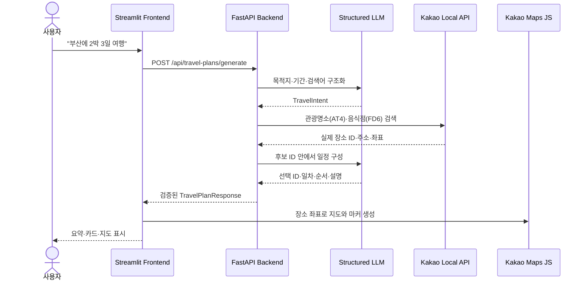

# 여행 지도 Agent Master Plan

> 가칭 프로젝트명: `travel_map_agent`
> 기준 프로젝트: `mini_agent_02_structured_output`
> 상태: 설계 초안

## 1. 프로젝트 목표

사용자가 자연어로 여행 요청을 입력하면 여행지와 기간을 구조화하고, 실제 관광명소와 음식점을 카카오 장소 데이터로 확인한 뒤 카드와 카카오 지도에 표시한다.

대표 사용자 요청:

> 부산에 2박 3일 여행을 가고 싶어. 바다와 현지 음식을 좋아해.

핵심 결과:

- 목적지와 `nights`, `days`를 구조화한다.
- `landmarks`와 `foods`를 각각 배열로 반환한다.
- 장소 ID, 주소, 좌표, 전화번호, 상세 URL은 Kakao Local API 결과만 사용한다.
- 프런트엔드는 같은 장소 목록을 카드와 카카오 지도 마커로 표현한다.

## 2. 핵심 설계 결정

| 영역 | 결정 | 이유 |
|---|---|---|
| 백엔드 | FastAPI 유지 | 현재 라우터, Pydantic, Provider, 테스트 구조를 재사용할 수 있다. |
| 프런트엔드 | Streamlit 유지 | 현재 앱과 HTTP client 패턴을 그대로 활용해 MVP를 빠르게 만든다. |
| LLM | Mock, Gemini, OpenAI, Ollama 계약 유지 | 개발 시 Mock으로 검증하고 실제 Provider를 같은 응답 계약으로 교체한다. |
| 장소 검색 | Kakao Local REST API를 백엔드에서 호출 | REST API 키를 브라우저에 노출하지 않고 실제 장소 데이터만 반환한다. |
| 지도 출력 | Kakao Maps JavaScript SDK | JavaScript 키와 등록 도메인을 이용해 마커와 정보창을 표시한다. |
| 장소 신뢰성 | LLM은 Kakao 장소 ID 목록 안에서만 선택 | 존재하지 않는 장소와 임의 좌표 생성을 막는다. |
| 데이터 저장 | MVP에서는 DB 없음 | 한 번의 질문과 응답 흐름에 집중한다. |

배열 필드명은 JSON 관례에 맞게 `landmarks`, `foods`로 통일한다.

## 3. 현재 프로젝트에서 확인한 재사용 기반

현재 프로젝트는 다음 기반을 이미 갖추고 있다.

- `backend/app/main.py`: FastAPI 앱과 라우터 등록
- `backend/app/config.py`: 루트 `.env` 로딩과 설정 객체
- `backend/app/providers.py`: Mock, Gemini, OpenAI, Ollama 호출 및 구조화 출력
- `backend/app/schemas.py`: Pydantic 계약과 `extra="forbid"` 검증
- `backend/app/routers/agent_router.py`: 요청, Provider 선택, 예외 변환 패턴
- `backend/tests/test_api.py`: TestClient, monkeypatch, fake client 테스트
- `frontend/app.py`: Streamlit 페이지 구성
- `frontend/core/api_client.py`: 공통 httpx 요청과 오류 처리
- `frontend/clients/agent_client.py`: 기능별 얇은 API client 패턴
- `frontend/app_pages/09_structured_output.py`: 입력 → API 호출 → 구조화 결과 출력 흐름

여행 지도 MVP에는 SupportTicket, 이미지 분석, TTS, 개념 비교 화면을 복사하지 않는다.

## 4. MVP 범위

### 포함

- 자연어 여행 요청 입력
- LLM Provider 선택
- 목적지, 박·일, 선호도 구조화
- 관광명소와 음식점 후보 검색
- Kakao 장소 ID, 주소, 좌표 보강
- 일차와 방문 순서가 있는 여행 계획
- 여행 요약, 장소 카드, 카카오 지도 마커
- 부분 검색 실패에 대한 `warnings`
- Mock 기반 자동 테스트와 실제 Gemini/Kakao smoke test

### 제외

- 회원가입과 로그인
- 예약, 결제, 가격 비교
- 실시간 영업시간과 휴무 보장
- 자동차·대중교통 경로 최적화
- 날씨, 숙박, 항공권
- 여행 계획 영구 저장과 공유
- 관리자 화면

## 5. 전체 실행 흐름



LLM 일정 구성에 실패하면 Kakao 정확도 순 후보를 일차별로 배분하는 deterministic fallback을 사용한다. 따라서 지도에는 Kakao에서 확인된 장소만 표시된다.

## 6. 공통 API 계약

### 요청

`POST /api/travel-plans/generate`

```json
{
  "message": "부산에 2박 3일 여행을 가고 싶어. 바다와 해산물을 좋아해.",
  "provider": "gemini",
  "landmark_count": 6,
  "food_count": 4
}
```

### 응답

```json
{
  "provider": "gemini",
  "model": "configured-gemini-model",
  "latency_ms": 2450,
  "content": {
    "destination": "부산",
    "summary": "해안 명소와 부산 음식을 즐기는 2박 3일 일정입니다.",
    "nights": 2,
    "days": 3,
    "landmarks": [
      {
        "id": "kakao-place-id",
        "name": "해운대해수욕장",
        "place_type": "landmark",
        "category_name": "여행 > 관광명소 > 해수욕장",
        "description": "첫째 날 부산의 대표 해변을 둘러봅니다.",
        "address": "부산 해운대구 우동",
        "road_address": "부산 해운대구 해운대해변로 264",
        "latitude": 35.1587,
        "longitude": 129.1604,
        "phone": "",
        "kakao_place_url": "https://place.map.kakao.com/...",
        "day": 1,
        "order": 1
      }
    ],
    "foods": []
  },
  "warnings": []
}
```

프런트와 백엔드는 이 계약을 각각 Pydantic 모델로 검증한다. 백엔드 모델을 프런트에서 직접 import하지 않고 JSON 계약만 공유한다.

## 7. 목표 폴더 구조

```text
travel_map_agent/
├── .env.example
├── .gitignore
├── requirements.txt
├── README.md
├── masterplan.md
├── frontend.md
├── backend.md
├── backend/
│   ├── app/
│   │   ├── __init__.py
│   │   ├── main.py
│   │   ├── config.py
│   │   ├── exceptions.py
│   │   ├── clients/
│   │   │   └── kakao_local_client.py
│   │   ├── providers/
│   │   │   ├── registry.py
│   │   │   ├── mock_provider.py
│   │   │   ├── gemini_provider.py
│   │   │   ├── openai_provider.py
│   │   │   └── ollama_provider.py
│   │   ├── routers/
│   │   │   ├── health_router.py
│   │   │   └── travel_plan_router.py
│   │   ├── schemas/
│   │   │   ├── kakao_local.py
│   │   │   └── travel_plan.py
│   │   └── services/
│   │       ├── place_search_service.py
│   │       └── travel_plan_service.py
│   └── tests/
│       ├── unit/
│       └── integration/
└── frontend/
    ├── app.py
    ├── app_pages/
    │   ├── 01_travel_planner.py
    │   └── 02_environment.py
    ├── clients/
    │   └── travel_client.py
    ├── components/
    │   ├── kakao_map.py
    │   ├── place_cards.py
    │   └── trip_summary.py
    ├── core/
    │   ├── api_client.py
    │   └── config.py
    ├── models/
    │   └── travel.py
    └── tests/
```

초기 구현에서는 기존 단일 `providers.py`, `schemas.py`를 복사해 시작해도 된다. API 계약이 안정된 뒤 위 구조로 분리한다.

## 8. 환경 변수

```dotenv
LLM_PROVIDER=mock

OPENAI_API_KEY=
OPENAI_MODEL=
GEMINI_API_KEY=
GEMINI_MODEL=
OLLAMA_BASE_URL=http://127.0.0.1:11434
OLLAMA_MODEL=llama3.2

KAKAO_REST_API_KEY=
KAKAO_JAVASCRIPT_KEY=
KAKAO_LOCAL_BASE_URL=https://dapi.kakao.com
KAKAO_REQUEST_TIMEOUT_SECONDS=5

BACKEND_API_URL=http://127.0.0.1:8000
REQUEST_TIMEOUT_SECONDS=60
```

- `KAKAO_REST_API_KEY`는 백엔드에서만 사용한다.
- `KAKAO_JAVASCRIPT_KEY`는 지도 SDK용 브라우저 키이며 도메인 제한이 보안 경계다.
- 실제 `.env`는 커밋하지 않고 `.env.example`에는 빈 값만 둔다.

## 9. 구현 로드맵

### 1단계: 프로젝트 골격과 Mock 계약

- 현재 프로젝트를 새 폴더로 복제하고 교육용 기능을 제거한다.
- 요청·응답 Pydantic 모델과 Mock 응답을 만든다.
- Swagger와 Streamlit에서 `landmarks`, `foods` 계약을 확인한다.

### 2단계: Kakao Local 연동

- REST API client, timeout, 오류 변환을 구현한다.
- `AT4` 관광명소와 `FD6` 음식점을 검색한다.
- `x → longitude`, `y → latitude` 변환과 중복 제거를 테스트한다.

### 3단계: LLM 구조화 계획

- 여행 의도와 검색어를 구조화한다.
- Kakao 후보 ID 안에서만 일정과 설명을 생성한다.
- Gemini는 `response_json_schema` 방식을 유지한다.

### 4단계: 카카오 지도 UI

- 카드, 일차 필터, 마커, 정보창을 구현한다.
- JavaScript 키와 개발·운영 도메인을 등록한다.
- 지도 실패 시 카드와 카카오맵 링크는 계속 제공한다.

### 5단계: 안정화

- 부분 성공, 빈 결과, 422, 502, 503, 504 처리를 구분한다.
- Mock 자동 테스트와 실제 외부 API smoke test를 분리한다.
- 보안, 로그, 실행 문서를 정리한다.

## 10. 완료 조건

- “부산에 2박 3일 여행” 요청이 `nights=2`, `days=3`으로 반환된다.
- 관광명소와 음식점이 각각 요청 개수 이하로 반환된다.
- 모든 장소에 유효한 Kakao 장소 ID와 위도·경도가 있다.
- 같은 데이터가 카드와 지도 마커에 모두 나타난다.
- 관광명소와 음식점 마커가 시각적으로 구분된다.
- 일차 필터를 변경하면 카드와 지도 결과가 함께 변경된다.
- LLM 또는 일부 장소 검색 실패는 사용자에게 이해 가능한 오류나 경고로 표시된다.
- API 키와 원본 SDK 예외가 응답, 로그, Git에 노출되지 않는다.
- 기본 테스트는 외부 네트워크 없이 통과한다.

## 11. 주요 위험과 대응

| 위험 | 대응 |
|---|---|
| LLM이 존재하지 않는 장소를 생성 | Kakao 후보 ID만 선택하게 하고 최종 join에서 미확인 ID를 제거한다. |
| 카카오 검색 결과가 목적지와 다름 | 목적지 주소, 카테고리, 장소명 점수로 필터링하고 기준 미달 결과를 제외한다. |
| `x`, `y` 좌표를 반대로 사용 | 백엔드에서 명시적으로 float 변환하고 좌표 단위 테스트를 둔다. |
| 지도 JavaScript 키 오류 | 등록 도메인을 확인하고 지도 없이 카드·상세 링크를 제공한다. |
| 외부 API 지연과 비용 | 개수 제한, 짧은 timeout, 선택적 캐시, Mock 기본값을 사용한다. |
| Streamlit iframe 제약 | 실제 `localhost:8501`과 운영 도메인에서 지도 smoke test를 수행한다. |

## 12. 상세 문서

- [프런트엔드 계획](frontend.md)
- [백엔드 계획](backend.md)

## 13. 공식 참고 자료

- [Kakao 지도 Web API 가이드](https://apis.map.kakao.com/web/guide/)
- [Kakao 지도 Web API 문서](https://apis.map.kakao.com/web/documentation/)
- [Kakao Local REST API](https://developers.kakao.com/docs/ko/local/dev-guide)
- [Kakao 앱 키 설정](https://developers.kakao.com/docs/ko/app-setting/app)
- [Kakao 보안 권장 사항](https://developers.kakao.com/docs/ko/getting-started/security-guideline)
